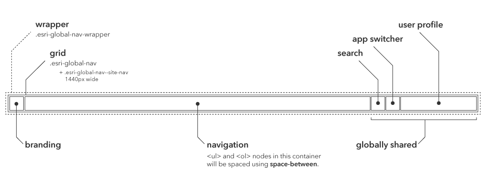
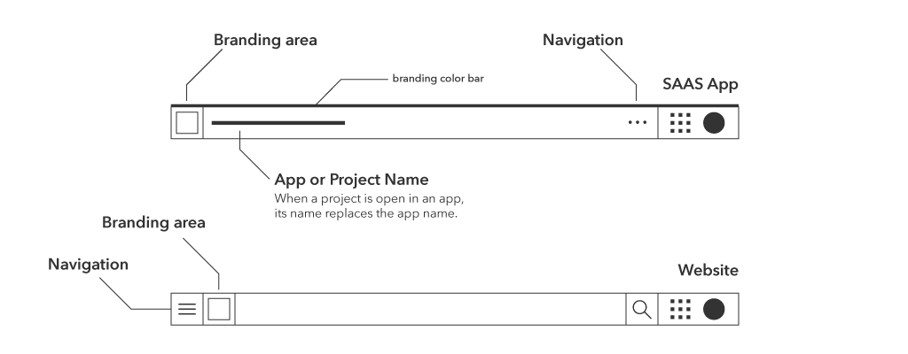

# Esri Global Navigation [][Esri Global Navigation]

[![Build Status][cli-img]][cli-url]
[![Licensing][lic-img]][lic-url]
[![Changelog][log-img]][log-url]

This document details the elements used to present the [Esri Global Navigation] \(gnav) component.


| Element | Uses | From | Required | Limitations |
|:------- |:---- |:----:|:--------:|:-----------:|
| brand  | [Gnav Brand]  | | | 1  |
| menus  | [Gnav Menus]  | | | 1+ |
| search | [Gnav Search] | | | 1  |
| user   | [Gnav User]   | | | 1  |

```json
{
  "brand":  { ... },
  "menus":  [ ... ],
  "search": { ... },
  "apps":   { ... },
  "user":   { ... }
}
```

- If `brand` is not specified, then it will not appear.
- If no `menus` are specified, then they will not appear.
- If `menus` contains more than one item, they will be visually justified.
- If `search` is not specified, then it will not appear.
- If `apps` is not specified, then it will not appear.
- If `user` is not specified, then it will not appear.

### Gnav Brand


| Element | Uses | From | Required | Limitations |
|:------- |:---- |:----:|:--------:|:-----------:|
| label | plain text | input text | • | 1 |
| image | image url  | input url  | • | 1 |
| href  | url        | input url  | | 1 |

```json
{
  "brand": {
    "label": "hidden accessible label",
    "image": "//domain/path/to/image",
    "href":  "//domain/path/to/destination"
  }
}
```

- If `brand` is not specified, then it will not appear.

### Gnav Menus


| Element | Uses | From | Required | Limitations |
|:------- |:---- |:----:|:--------:|:-----------:|
| label | plain text      | input text | • | 1  |
| href  | url             | input url  |   | 1  |
| menus | [Gnav Menus]    |            |   | 1+ | 

```json
{
  "menus": [
    [
      {
        "label": "visible item name",
        "href":  "/path/to/destination"
      },
      { ... }
    ],
    [
      {
        "label": "secondary navigation",
        "href":  "/path/to/destination",
        "menus": [
          {
            "label": "child item",
            "href":  "/path/to/destination"
          },
          ...
        ]
      },
      { ... }
    ]
  ]
}
```

- If no `menus` are specified, then they will not appear.
- If `menus` contains more than one item, they will be visually justified.
- While `menus` may nest infinitly, only the top and child items will be used.

### Gnav Search


| Element | Uses | From | Required | Limitations |
|:------- |:---- |:----:|:--------:|:-----------:|
| label | plain text | input text | • | 1 |

```json
{
  "search": {
    "label": "hidden accessible label"
  }
}
```

- If `search` is not specified, then it will not appear.

### Gnav Apps


| Element | Uses | From | Required | Limitations |
|:------- |:---- |:----:|:--------:|:-----------:|
| label  | plain text | input text    | • | 1 |
| image  | image url  | image gallery | • | 1 |
| href   | url        | input url     | • | 1 |

```json
{
  "apps": [
    {
      "label": "Application Name",
      "image": "/path/to/image",
      "href":  "/path/to/destination"
    },
    ...
  ]
}
```

- If `apps` is not specified, then it will not appear.

### Gnav User


| Element | Uses | From | Required | Limitations |
|:------- |:---- |:----:|:--------:|:-----------:|
| label  | plain text | input text | • | 1 |
| name   | plain text | input text | • | 1 |
| id     | plain text | input text | • | 1 |
| avatar | image url  | input url  | • | 1 |

```json
{
  "user": {
    "label":  "Sign In",
    "name":   "Bruce Campbell",
    "id":     "GroovyBruce",
    "avatar": "/path/to/avatar"
  }
}
```

- If `user` is not specified, then it will not appear.
- `label` is used to display the “*Login*” text.

---

## Gnav Events

This section details the events emitted by Global Navigation component during user interaction.

- Events are prefixed with `esri-gnav:`.
- Events bubble up to the window.
- Events `target` is the deepest applicable element
- Events `currentTarget` is the components outermost container.

### `click`

Returns the element within the global nav that is clicked.

```js
addEventListener(
  'esri-gnav:click',
  (event) => console.log('clicked:', event.target)
)
```

### `click:login`

Returns the login element within the global nav that is clicked.

```js
addEventListener(
  'esri-gnav:login',
  (event) => console.log('clicked login:', event.target)
)
```

### `click:search`

Returns the search element within the global nav that is clicked.

```js
addEventListener(
  'esri-gnav:search',
  (event) => console.log('clicked search:', event.target)
)
```

### `click:menu`

Returns the menu element within the global nav that is clicked.

```js
addEventListener(
  'esri-gnav:menu',
  (event) => console.log('clicked menu:', event.target)
)
```

### `expand`

Returns the element within the global nav that has triggered an expand.

```js
addEventListener(
  'esri-gnav:expand',
  (event) => console.log('expand from:', event.target)
)
```

### `expanded`

Returns the element within the global nav that has been expanded.

```js
addEventListener(
  'esri-gnav:expanded',
  (event) => console.log('expanded element:', event.target)
)
```

---


## Structure



The component has three sections:

* Branding
* Navigation
* Globally-shared

The **Navigation** section has the greatest flexibility.  That being said, the default styles applied to this section should require little and possibly no customization to address individual needs.

This section also includes some nice styles and animations for the sub-nav elements.

The **Branding** section contains styles for SAAS applications which are distinct from site pages.

The **Globally-shared** section should receive little to no customization within your implementation.  It contains the following:
* Search link
* App Switcher
* User Profile and profile dropdown

#### Tablet



SAAS Apps
* Nav items are condensed and hidden under the ellipses icon and lives on the right.
* App name/Project name remains
* Logo remains (takes you to dashboard)

Website
* Nav items are condensed and hidden under the burger icon and lives on the left.
* Logo remains (takes you home)

[Esri Global Navigation]: https://github.com/ArcGIS/esri-global-nav

[cli-url]: https://travis-ci.com/ArcGIS/esri-global-nav
[cli-img]: https://api.travis-ci.com/ArcGIS/esri-global-nav.svg?token=mqvp34VgHUamyk5XDa9d
[lic-url]: LICENSE.md
[lic-img]: https://img.shields.io/badge/license-CC0--1.0-blue.svg
[log-url]: CHANGELOG.md
[log-img]: https://img.shields.io/badge/changelog-md-blue.svg

[Gnav]: #global-navigation-gnav-component
[Gnav Brand]: #gnav-brand
[Gnav Menus]: #gnav-menus
[Gnav Search]: #gnav-search
[Gnav User]: #gnav-user
[Gnav Events]: #gnav-events
