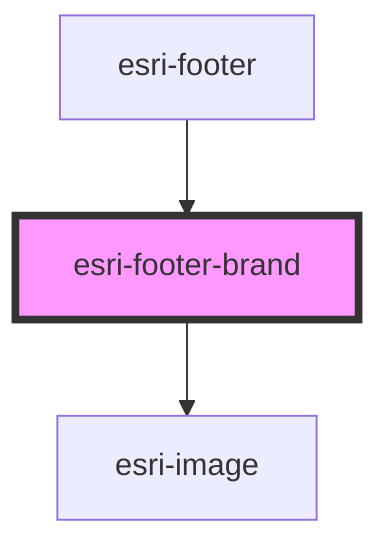

# global-nav-

<!-- Auto Generated Below -->

## Properties

| Property  | Attribute  | Description | Type                 | Default     |
| --------- | ---------- | ----------- | -------------------- | ----------- |
| `href`    | `href`     |             | `string`             | `undefined` |
| `label`   | `label`    |             | `string`             | `undefined` |
| `path`    | `path`     |             | `string \| string[]` | `undefined` |
| `viewBox` | `view-box` |             | `string`             | `undefined` |

## Dependencies

### Used by

 - [esri-footer](../esri-footer)

### Depends on

- [esri-image](../esri-image)

### Graph

----------------------------------------------

*Built with [StencilJS](https://stenciljs.com/)*
