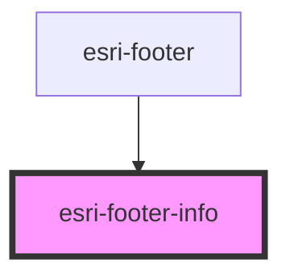

# global-nav-

<!-- Auto Generated Below -->

## Properties

| Property | Attribute | Description | Type           | Default     |
| -------- | --------- | ----------- | -------------- | ----------- |
| `label`  | `label`   |             | `string`       | `undefined` |
| `menu`   | --        |             | `FooterLink[]` | `[]`        |

## Dependencies

### Used by

 - [esri-footer](../esri-footer)

### Graph

----------------------------------------------

*Built with [StencilJS](https://stenciljs.com/)*
