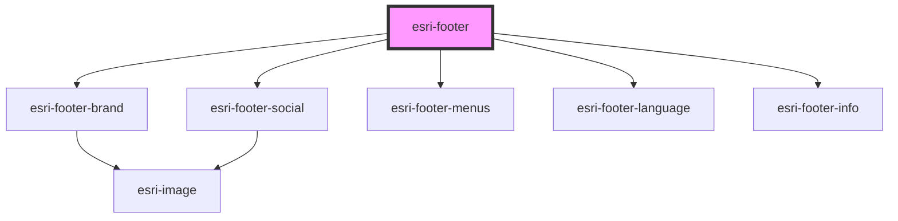

# global-nav-

<!-- Auto Generated Below -->

## Properties

| Property    | Attribute    | Description                                                                                                                                                                 | Type      | Default |
| ----------- | ------------ | --------------------------------------------------------------------------------------------------------------------------------------------------------------------------- | --------- | ------- |
| `hideMenus` | `hide-menus` | Be sure to add a jsdoc comment describing your propery for the generated readme file. If your property should be hidden from documentation, you can use the `@internal` tag | `boolean` | `false` |
| `label`     | `label`      |                                                                                                                                                                             | `string`  | `""`    |

## Events

| Event  | Description | Type               |
| ------ | ----------- | ------------------ |
| `open` |             | `CustomEvent<any>` |

## Methods

### `init(detail: any) => Promise<void>`

If using the header programatically, you can pass in the data structure
to the init method, and it will create all sub elements for you.

#### Returns

Type: `Promise<void>`

## Dependencies

### Depends on

- [esri-footer-brand](../esri-footer-brand)
- [esri-footer-social](../esri-footer-social)
- [esri-footer-menus](../esri-footer-menus)
- [esri-footer-language](../esri-footer-language)
- [esri-footer-info](../esri-footer-info)

### Graph

----------------------------------------------

*Built with [StencilJS](https://stenciljs.com/)*
