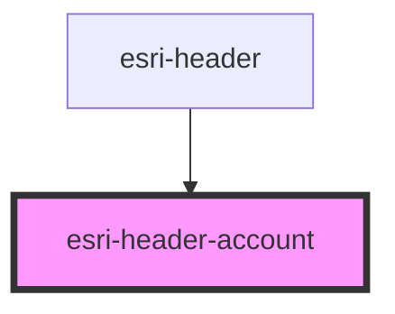

# global-nav-

<!-- Auto Generated Below -->

## Properties

| Property      | Attribute       | Description                           | Type             | Default             |
| ------------- | --------------- | ------------------------------------- | ---------------- | ------------------- |
| `menus`       | --              | Array of links to appear in user menu | `UserMenuLink[]` | `[]`                |
| `open`        | `open`          | Open state of the menu                | `boolean`        | `undefined`         |
| `profileText` | `profile-text`  | Translated string for profile         | `string`         | `"Account profile"` |
| `signInText`  | `sign-in-text`  | Translated string for sign in         | `string`         | `"Sign in"`         |
| `signOutText` | `sign-out-text` | Translated string for sign out        | `string`         | `"Sign out"`        |
| `switchText`  | `switch-text`   | Translated string for switch account  | `string`         | `"Switch account"`  |
| `userGroup`   | `user-group`    | Organization name                     | `string`         | `undefined`         |
| `userId`      | `user-id`       | Unique user id                        | `string`         | `undefined`         |
| `userImage`   | `user-image`    | Absolute path to profile photo        | `string`         | `undefined`         |
| `userName`    | `user-name`     | Human-readable name of the user       | `string`         | `undefined`         |

## Events

| Event                  | Description | Type               |
| ---------------------- | ----------- | ------------------ |
| `header:click:account` |             | `CustomEvent<any>` |
| `header:click:signin`  |             | `CustomEvent<any>` |
| `header:click:signout` |             | `CustomEvent<any>` |
| `header:click:switch`  |             | `CustomEvent<any>` |
| `header:menu:toggle`   |             | `CustomEvent<any>` |

## Methods

### `doThing() => Promise<void>`

Add a jsdoc comment describing your method and it's parameters (use `@param`).

#### Returns

Type: `Promise<void>`

## Dependencies

### Used by

 - [esri-header](../esri-header)

### Graph

----------------------------------------------

*Built with [StencilJS](https://stenciljs.com/)*
