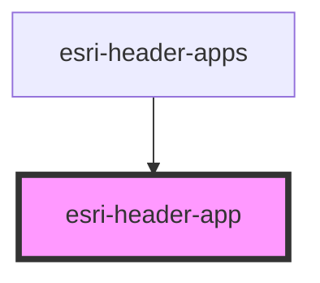

# esri-header-app

<!-- Auto Generated Below -->

## Properties

| Property          | Attribute           | Description                                             | Type      | Default                              |
| ----------------- | ------------------- | ------------------------------------------------------- | --------- | ------------------------------------ |
| `abbr`            | `abbr`              | abbreviation for placeholder icon                       | `string`  | `undefined`                          |
| `bottom`          | `bottom`            | true if app can move down                               | `boolean` | `undefined`                          |
| `canAccess`       | `can-access`        | set to false for invalid or removed apps                | `boolean` | `undefined`                          |
| `image`           | `image`             | app icon (>48x48)                                       | `string`  | `undefined`                          |
| `isNew`           | `is-new`            | set to true for recently added apps                     | `boolean` | `undefined`                          |
| `itemId`          | `item-id`           | Unique id of the app item (required)                    | `string`  | `undefined`                          |
| `label`           | `label`             | Title of the app                                        | `string`  | `undefined`                          |
| `left`            | `left`              | true if app can move left                               | `boolean` | `undefined`                          |
| `placeHolderIcon` | `place-holder-icon` | background image for abbreviation (>48x48)              | `string`  | `undefined`                          |
| `removeText`      | `remove-text`       | Translated string for removed application               | `string`  | `"Remove app from app launcher"`     |
| `removedText`     | `removed-text`      | Translated string for removed application               | `string`  | `"This app is no longer available."` |
| `right`           | `right`             | true if app can move right                              | `boolean` | `undefined`                          |
| `secondary`       | `secondary`         | true if app is in the lower app section of the launcher | `boolean` | `undefined`                          |
| `top`             | `top`               | true if app can move up                                 | `boolean` | `undefined`                          |
| `url`             | `url`               | href for the app's link                                 | `string`  | `undefined`                          |

## Events

| Event                   | Description | Type               |
| ----------------------- | ----------- | ------------------ |
| `header:app:edit:start` |             | `CustomEvent<any>` |
| `header:app:move`       |             | `CustomEvent<any>` |
| `header:app:remove`     |             | `CustomEvent<any>` |

## Dependencies

### Used by

 - [esri-header-apps](../esri-header-apps)

### Graph

----------------------------------------------

*Built with [StencilJS](https://stenciljs.com/)*
