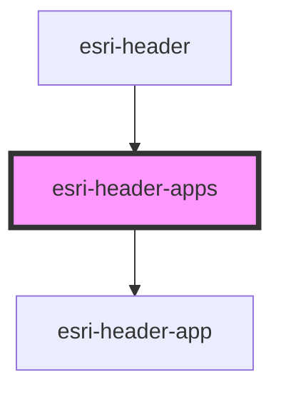

# global-nav-

<!-- Auto Generated Below -->

## Properties

| Property             | Attribute               | Description                                                    | Type            | Default                                                                           |
| -------------------- | ----------------------- | -------------------------------------------------------------- | --------------- | --------------------------------------------------------------------------------- |
| `applicationsText`   | `applications-text`     | Translated string for app launcher label                       | `string`        | `"App Launcher"`                                                                  |
| `confirmText`        | `confirm-text`          | Translated string for dismissing help message                  | `string`        | `"Got it."`                                                                       |
| `disableDragAndDrop` | `disable-drag-and-drop` | Disallow dragging and dropping to reorder applications         | `boolean`       | `undefined`                                                                       |
| `displayIntro`       | `display-intro`         | Show help message upon opening app switcher                    | `boolean`       | `true`                                                                            |
| `dragAppsHereText`   | `drag-apps-here-text`   | Translated string for secondary help                           | `string`        | `"Drag apps here that you don't use very often."`                                 |
| `introText`          | `intro-text`            | Translated string for drang and drop help                      | `string`        | `"Drag and drop your favorite apps in any order to customize your app launcher."` |
| `loading`            | `loading`               | Set to true while apps are being fetched                       | `boolean`       | `undefined`                                                                       |
| `open`               | `open`                  | Open state of the menu                                         | `boolean`       | `undefined`                                                                       |
| `primary`            | --                      | Array of applications to appear in top section of app launcher | `Application[]` | `[]`                                                                              |
| `removeText`         | `remove-text`           | Translated string for removed application                      | `string`        | `"Remove app from app launcher"`                                                  |
| `removedText`        | `removed-text`          | Translated string for removed application                      | `string`        | `"This app is no longer available."`                                              |
| `secondary`          | --                      | Array of applications to appear in bottom hidden section       | `Application[]` | `[]`                                                                              |
| `showMoreText`       | `show-more-text`        | Translated string for show more                                | `string`        | `"Show more"`                                                                     |

## Events

| Event                 | Description | Type               |
| --------------------- | ----------- | ------------------ |
| `header:apps:reorder` |             | `CustomEvent<any>` |
| `header:menu:toggle`  |             | `CustomEvent<any>` |

## Dependencies

### Used by

 - [esri-header](../esri-header)

### Depends on

- [esri-header-app](../esri-header-app)

### Graph

----------------------------------------------

*Built with [StencilJS](https://stenciljs.com/)*
