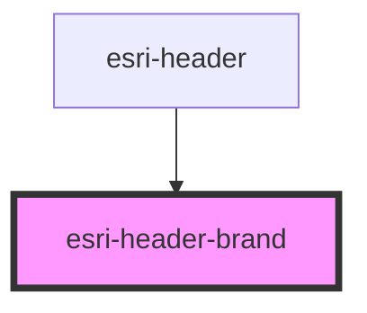

# global-nav-

<!-- Auto Generated Below -->

## Properties

| Property                 | Attribute                  | Description | Type               | Default     |
| ------------------------ | -------------------------- | ----------- | ------------------ | ----------- |
| `brandText`              | `brand-text`               |             | `string`           | `undefined` |
| `detail`                 | `detail`                   |             | `any`              | `{}`        |
| `distributorImage`       | `distributor-image`        |             | `SvgDef \| string` | `undefined` |
| `distributorImageHeight` | `distributor-image-height` |             | `number`           | `undefined` |
| `distributorImageWidth`  | `distributor-image-width`  |             | `number`           | `undefined` |
| `height`                 | `height`                   |             | `number`           | `undefined` |
| `href`                   | `href`                     |             | `string`           | `undefined` |
| `image`                  | `image`                    |             | `SvgDef \| string` | `undefined` |
| `label`                  | `label`                    |             | `string`           | `undefined` |
| `width`                  | `width`                    |             | `number`           | `undefined` |

## Events

| Event  | Description | Type               |
| ------ | ----------- | ------------------ |
| `open` |             | `CustomEvent<any>` |

## Dependencies

### Used by

 - [esri-header](../esri-header)

### Graph

----------------------------------------------

*Built with [StencilJS](https://stenciljs.com/)*
