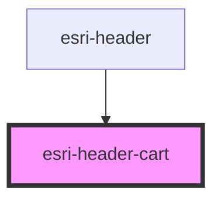

# global-nav-

<!-- Auto Generated Below -->

## Properties

| Property | Attribute | Description | Type     | Default |
| -------- | --------- | ----------- | -------- | ------- |
| `items`  | `items`   |             | `number` | `0`     |
| `url`    | `url`     |             | `string` | `"#"`   |

## Dependencies

### Used by

 - [esri-header](../esri-header)

### Graph

----------------------------------------------

*Built with [StencilJS](https://stenciljs.com/)*
