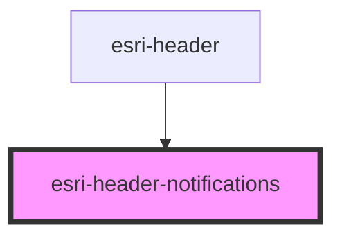

# global-nav-

<!-- Auto Generated Below -->

## Properties

| Property | Attribute | Description                                                                                                                                                                 | Type  | Default |
| -------- | --------- | --------------------------------------------------------------------------------------------------------------------------------------------------------------------------- | ----- | ------- |
| `detail` | `detail`  | Be sure to add a jsdoc comment describing your propery for the generated readme file. If your property should be hidden from documentation, you can use the `@internal` tag | `any` | `{}`    |

## Events

| Event  | Description | Type               |
| ------ | ----------- | ------------------ |
| `open` |             | `CustomEvent<any>` |

## Methods

### `doThing() => Promise<void>`

Add a jsdoc comment describing your method and it's parameters (use `@param`).

#### Returns

Type: `Promise<void>`

## Dependencies

### Used by

 - [esri-header](../esri-header)

### Graph

----------------------------------------------

*Built with [StencilJS](https://stenciljs.com/)*
