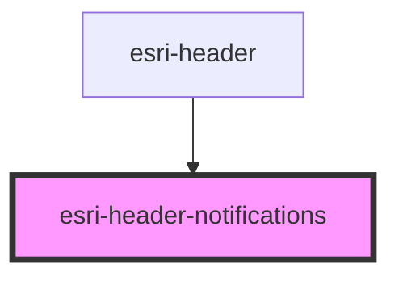

# global-nav-

<!-- Auto Generated Below -->

## Properties

| Property          | Attribute           | Description                                     | Type             | Default              |
| ----------------- | ------------------- | ----------------------------------------------- | ---------------- | -------------------- |
| `dismissAllLabel` | `dismiss-all-label` | Text for button that clears all notifications   | `string`         | `"Dismiss all"`      |
| `dismissLabel`    | `dismiss-label`     | Aria label for noticiation X                    | `string`         | `"Dismiss"`          |
| `emptyMessage`    | `empty-message`     | Text to display when no notifications are found | `string`         | `"No notifications"` |
| `messages`        | --                  | array of current notification messages          | `Notification[]` | `[]`                 |
| `open`            | `open`              | Set true to open notifications dropdown         | `boolean`        | `undefined`          |

## Events

| Event                                | Description | Type               |
| ------------------------------------ | ----------- | ------------------ |
| `header:click:notifications:dismiss` |             | `CustomEvent<any>` |
| `header:menu:toggle`                 |             | `CustomEvent<any>` |

## Dependencies

### Used by

 - [esri-header](../esri-header)

### Graph

----------------------------------------------

*Built with [StencilJS](https://stenciljs.com/)*
