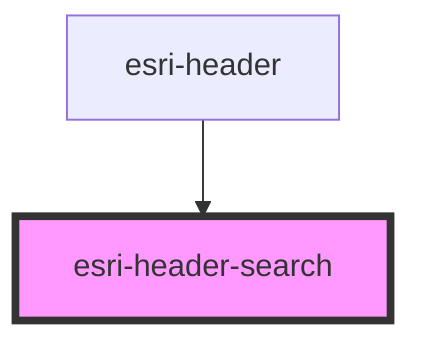

# global-nav-

<!-- Auto Generated Below -->

## Properties

| Property          | Attribute          | Description                              | Type      | Default     |
| ----------------- | ------------------ | ---------------------------------------- | --------- | ----------- |
| `action`          | `action`           | Form action url                          | `string`  | `""`        |
| `cancelText`      | `cancel-text`      | Translated cancel text                   | `string`  | `"Cancel"`  |
| `formText`        | `form-text`        | Translated string for aria label of form | `string`  | `"Esri"`    |
| `open`            | `open`             | Open state of the search UI              | `boolean` | `undefined` |
| `placeholderText` | `placeholder-text` | Translated input label text              | `string`  | `"Search"`  |
| `searchText`      | `search-text`      | Translated aria label for search icon    | `string`  | `"Search"`  |
| `submitText`      | `submit-text`      | Translated submit text                   | `string`  | `""`        |

## Events

| Event                | Description | Type               |
| -------------------- | ----------- | ------------------ |
| `header:menu:toggle` |             | `CustomEvent<any>` |

## Dependencies

### Used by

 - [esri-header](../esri-header)

### Graph

----------------------------------------------

*Built with [StencilJS](https://stenciljs.com/)*
