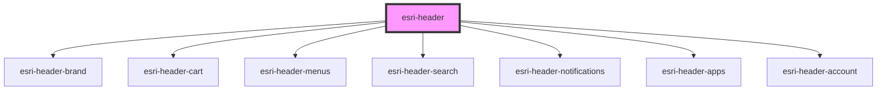

# global-nav-

<!-- Auto Generated Below -->

## Properties

| Property        | Attribute        | Description                                                          | Type             | Default     |
| --------------- | ---------------- | -------------------------------------------------------------------- | ---------------- | ----------- |
| `collapseMenus` | `collapse-menus` | Set to `true` to show hamburger menu regardless of screen size       | `boolean`        | `undefined` |
| `theme`         | `theme`          | App mode will show a color bar at the top and float menu items right | `"app" \| "web"` | `"web"`     |

## Events

| Event  | Description | Type               |
| ------ | ----------- | ------------------ |
| `open` |             | `CustomEvent<any>` |

## Methods

### `init(detail: any) => Promise<void>`

If using the header programatically, you can pass in the data structure
to the init method, and it will create all sub elements for you.

#### Returns

Type: `Promise<void>`

## Dependencies

### Depends on

- [esri-header-brand](../esri-header-brand)
- [esri-header-cart](../esri-header-cart)
- [esri-header-menus](../esri-header-menus)
- [esri-header-search](../esri-header-search)
- [esri-header-notifications](../esri-header-notifications)
- [esri-header-apps](../esri-header-apps)
- [esri-header-account](../esri-header-account)

### Graph

----------------------------------------------

*Built with [StencilJS](https://stenciljs.com/)*
