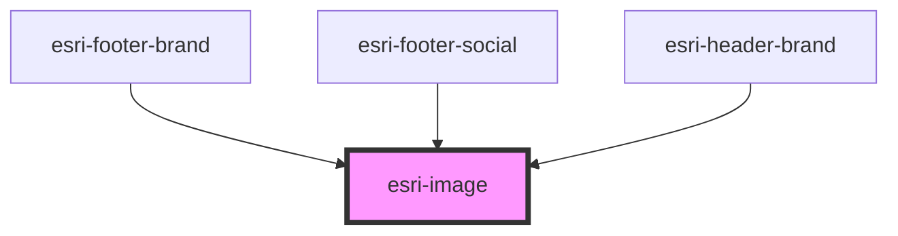

# esri-image

<!-- Auto Generated Below -->

## Properties

| Property       | Attribute       | Description | Type                 | Default          |
| -------------- | --------------- | ----------- | -------------------- | ---------------- |
| `imgAlt`       | `img-alt`       |             | `string`             | `undefined`      |
| `imgClass`     | `img-class`     |             | `string`             | `undefined`      |
| `imgFill`      | `img-fill`      |             | `string`             | `"currentColor"` |
| `imgHeight`    | `img-height`    |             | `string`             | `undefined`      |
| `imgWidth`     | `img-width`     |             | `string`             | `undefined`      |
| `inlineImg`    | `inline-img`    |             | `boolean`            | `true`           |
| `path`         | `path`          |             | `string \| string[]` | `undefined`      |
| `viewBox`      | `view-box`      |             | `string`             | `undefined`      |
| `wrapperClass` | `wrapper-class` |             | `string`             | `undefined`      |

## Dependencies

### Used by

 - [esri-footer-brand](../esri-footer-brand)
 - [esri-footer-social](../esri-footer-social)
 - [esri-header-brand](../esri-header-brand)

### Graph

----------------------------------------------

*Built with [StencilJS](https://stenciljs.com/)*
